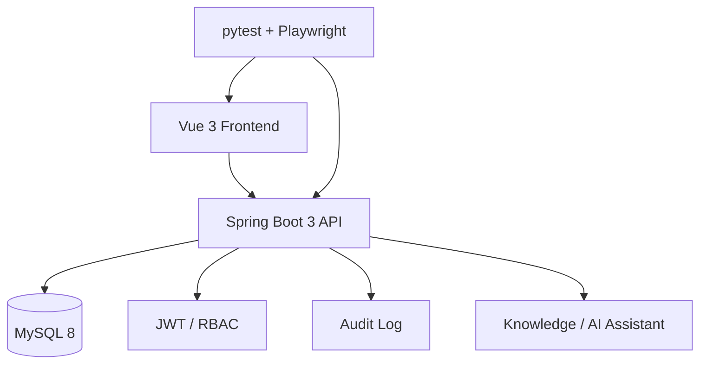

<div align="center">

# Pysystem

**A full-stack pharmacy management system for inventory, sales, staff, audit and AI-assisted help.**

[English](./README.md) | [简体中文](./README.zh-CN.md)

[](https://spring.io/projects/spring-boot)
[](https://vuejs.org)
[](docker-compose.yml)
[](#-testing)

</div>

---

## 🎯 What it is

Pysystem is a full-stack pharmacy operations project covering:

- employee accounts and RBAC
- medicine catalog
- purchasing
- sales
- inventory and low-stock alerts
- dashboards and charts
- audit logs
- local knowledge-base / AI assistant integration

It is primarily an engineering reference project rather than a production-ready pharmacy SaaS.

---

## 🎬 Demo

<div align="center">


</div>

---

## ⚡ Quick Start

```bash
git clone https://github.com/Dream22180971/Pysystem.git
cd Pysystem

docker compose up -d --build
```

Then open:

- Frontend: `http://127.0.0.1:5173`
- Backend health: `http://127.0.0.1:8080/actuator/health`

Docker Compose starts MySQL, backend and frontend together.

---

## 🧩 Architecture



---

## ✨ Main Modules

| Module | Responsibility |
|---|---|
| Dashboard | operating metrics and alerts |
| Employee | accounts and role control |
| Medicine | catalog and categories |
| Purchase | purchasing records |
| Sales | sales records |
| Inventory | stock management and low-stock alerts |
| Audit | operation trace |
| AI assistant | answer system-operation questions from local knowledge |

---

## 🧪 Testing

| Type | Tooling | Coverage |
|---|---|---|
| API | pytest + requests | health, auth and core APIs |
| E2E | Playwright | login, protected routes and main pages |
| CI | GitHub Actions | build, Docker startup and automated checks |

---

## 🔐 Security & Production Notes

Before real production use, review at least:

- password hashing strategy
- secret management
- persistent database volumes
- HTTPS and reverse proxy configuration
- backup / recovery
- production-grade RBAC and audit requirements

This repository is best treated as a full-stack engineering project and secondary-development base.

---

## 🗺 Roadmap

- [x] Spring Boot 3 + Vue 3
- [x] JWT + RBAC
- [x] employee / medicine / purchase / sales / inventory modules
- [x] dashboard charts
- [x] Docker Compose
- [x] knowledge-base / AI assistant
- [x] audit logs
- [x] automated testing
- [ ] mobile optimization
- [ ] multi-store support
- [ ] Excel export
- [ ] more model providers

---

## 📄 License

MIT

<div align="center">

**A business system is more than CRUD when permissions, audit, testing and operations are designed together.**

</div>
