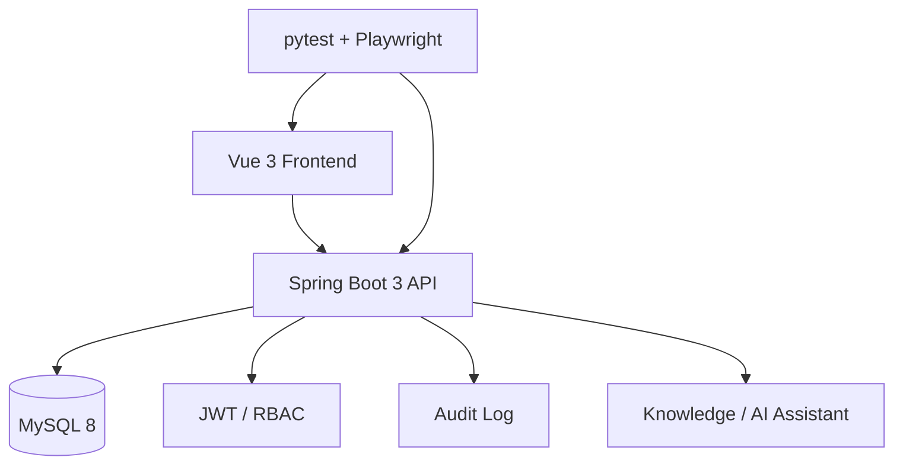

<div align="center">

# 智能药店管理系统 · Pysystem

**覆盖员工、药品、采购、销售、库存、审计与 AI 助手的全栈药店管理系统。**

[English](./README.md) | [简体中文](./README.zh-CN.md)

[](https://spring.io/projects/spring-boot)
[](https://vuejs.org)
[](docker-compose.yml)
[](#-自动化测试)

</div>

---

## 🎯 它是什么

Pysystem 是一个完整的药店业务管理工程项目，覆盖：

- 员工账号与 RBAC
- 药品目录
- 采购
- 销售
- 库存与低库存预警
- 经营看板
- 操作审计
- 本地知识库 / AI 助手

它更适合作为完整工程参考与二次开发基础，而不是直接声称已经达到生产 SaaS 标准。

---

## 🎬 演示

<div align="center">


</div>

---

## ⚡ 5 分钟快速开始

```bash
git clone https://github.com/Dream22180971/Pysystem.git
cd Pysystem

docker compose up -d --build
```

启动后：

- 前端：`http://127.0.0.1:5173`
- 后端健康检查：`http://127.0.0.1:8080/actuator/health`

Docker Compose 会一起启动 MySQL、后端和前端。

---

## 🧩 技术架构



---

## ✨ 核心模块

| 模块 | 作用 |
|---|---|
| 看板 | 经营指标与预警 |
| 员工 | 账号与角色权限 |
| 药品 | 药品与分类 |
| 采购 | 采购记录 |
| 销售 | 销售记录 |
| 库存 | 库存管理与低库存预警 |
| 审计 | 操作留痕 |
| AI 助手 | 基于本地知识回答系统操作问题 |

---

## 🧪 自动化测试

| 类型 | 技术 | 覆盖 |
|---|---|---|
| API | pytest + requests | 健康检查、鉴权、核心接口 |
| E2E | Playwright | 登录、权限路由、核心页面 |
| CI | GitHub Actions | 构建、Docker 启动、自动检查 |

---

## 🔐 安全与生产说明

真正上线前至少需要重新审查：

- 密码哈希方案
- Secret 管理
- 数据库持久化卷
- HTTPS / 反向代理
- 备份恢复
- 更严格的 RBAC 与审计要求

当前仓库更适合作为全栈工程项目和二次开发底座。

---

## 🗺 路线图

- [x] Spring Boot 3 + Vue 3
- [x] JWT + RBAC
- [x] 员工 / 药品 / 采购 / 销售 / 库存
- [x] 经营图表
- [x] Docker Compose
- [x] 知识库 / AI 助手
- [x] 操作审计
- [x] 自动化测试
- [ ] 移动端适配
- [ ] 多门店
- [ ] Excel 导出
- [ ] 更多模型供应商

---

## 📄 License

MIT

<div align="center">

**当权限、审计、测试和运维一起被设计时，业务系统才不只是 CRUD。**

</div>
